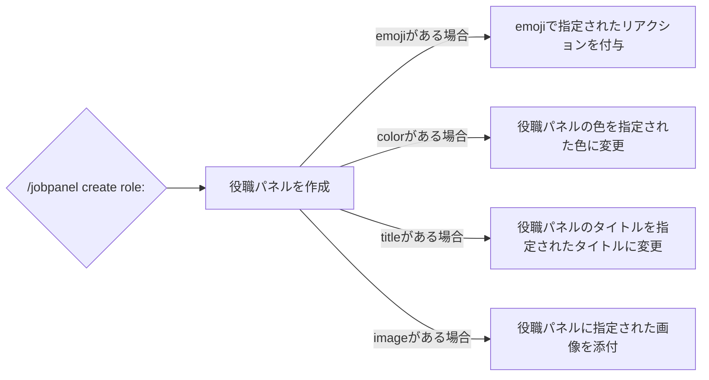

# create
## 使用方法
```
/jobpanel create role: <option>
```

オプション名 | 概要 | 必要かどうか
--- | --- | --
role | 付与する役職 | **<u>はい</u>**
emoji | roleに対応させる絵文字 | いいえ
color | 役職パネルの色 | いいえ
title | 役職パネルのタイトル | いいえ
image | 役職パネルに添付する画像 | いいえ

## 動作
