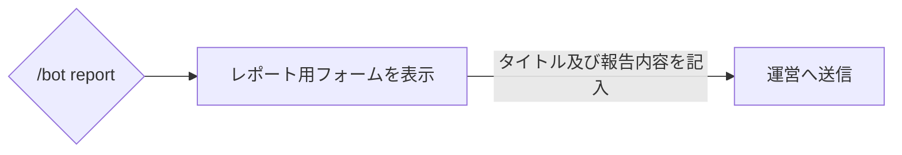
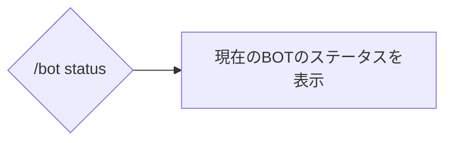

# /bot
## 概要
BOTに関する情報や運営への連絡を行えるコマンドです。

## 使用方法
```
/bot <subcommand>
```

!!!warning
このコマンドは単体では使用できません。サブコマンドの指定を行ってください。
!!!

サブコマンド名 | 概要 | ガイド
-- | -- | --
report | BOTに関するバグや要望を運営に送信します。 | [!badge variant="success" icon="paper-airplane" iconAlign="right" text="見る"](#report)
status | BOTのサーバーステータス等を表示します。 | [!badge variant="success" icon="paper-airplane" iconAlign="right" text="見る"](#status)

### report
#### 使用方法
```
/bot report
```

#### 動作


### status
#### 使用方法
```
/bot status
```

#### 動作


#### 表示されるステータス一覧
+++ プラットフォーム
サーバーに使用されているOSを表示します。
> 例：Linux
+++ CPU型番
サーバーに使用されているCPUを表示します。
> 例：Intel(R) Xeon(R) CPU E5-2640 v4 @ 2.40GHz
+++ CPU使用率
サーバーのCPU使用率を表示します。  
CPU使用率が高いほど、BOTの動作に支障をきたします。
> 例：29%
+++ メモリー使用率
サーバーのメインメモリーの使用率を表示します。  
メインメモリーの使用率が高いほど、BOTの動作に支障をきたします。
> 例：68%
+++ 参加ボイスチャンネル数
BOTが参加しているボイスチャンネルの数を表示します。  
参加しているボイスチャンネルが多いほど、メインメモリーの使用率が高くなる可能性があります。
> 例：3チャンネル
+++

+++ 視聴Twitch数
未設定
> 例：1チャンネル
+++ 視聴Youtube数
未設定
> 例：3チャンネル
+++ BOT応答時間
サーバーからDiscordへの応答時間を表示します。  
この数値が高いほどBOTの応答時間が長くなります。
> 例：330ms
+++ API応答時間
サーバーからDiscord APIへの応答時間を表示します。  
この数値が高いほどBOTの応答時間が長くなります。
> 例：164ms
+++ バージョン
現在のBOTのバージョンを表示します。
> 例：1.0.0