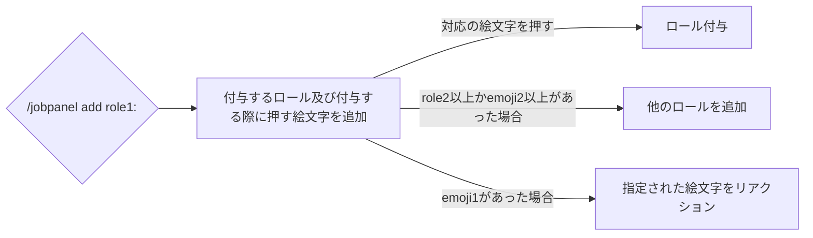

# /jobpanel add
## 使用方法
```
/jobpanel add role1: <option>
```

オプション名 | 概要 | 必要かどうか
--- | --- | --
role1 | 付与する役職 | **<u>はい</u>**
emoji1 | role1に対応させる絵文字 | いいえ
role2 ~ role10 | role1以外で付与する役職 | いいえ
emoji2 ~ emoji10 | role2 ~ role10に対応させる絵文字 | いいえ

## 動作
