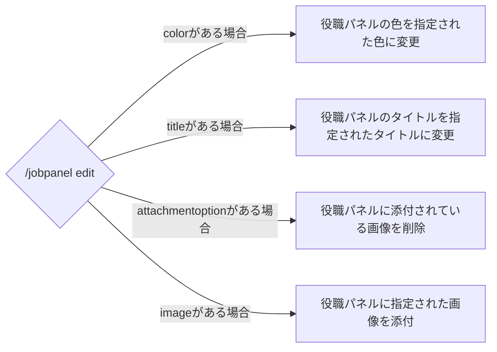

# /jobpanel edit
## 使用方法
```
/jobpanel edit <option>

```
!!!info
このコマンドはオプションを指定しなくても使用可能ですが、指定していない場合効果がありません。
!!!

オプション名 | 概要 | 必要かどうか
--- | --- | --
color | 役職パネルの色 | いいえ
title | 役職パネルのタイトル | いいえ
attachmentoption | 役職パネルの添付画像を削除するかどうか | いいえ
image | 役職パネルに添付する画像 | いいえ

## 動作
