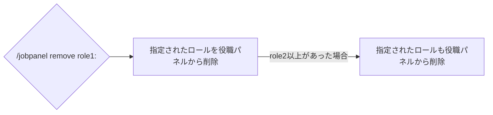

# /jobpanel remove
## 使用方法
```
/jobpanel remove role1: <option> 
```

オプション名 | 概要 | 必要かどうか
-- | -- | --
role1 | 削除するロール | **<u>はい</u>**
role2 ~ role25 | role1以外に削除するロール | いいえ

## 動作

```mermaid
graph LR
   A{/jobpanel remove role1:}
   A --> B[指定されたロールを役職パネルから削除]
   B -->|role2以上があった場合| C[指定されたロールも役職パネルから削除]
```