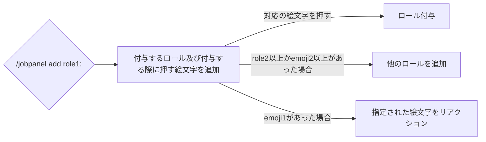
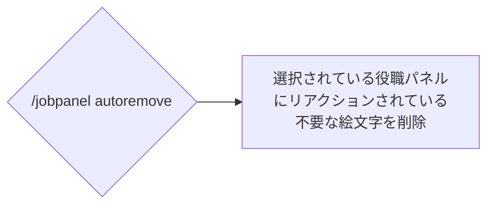
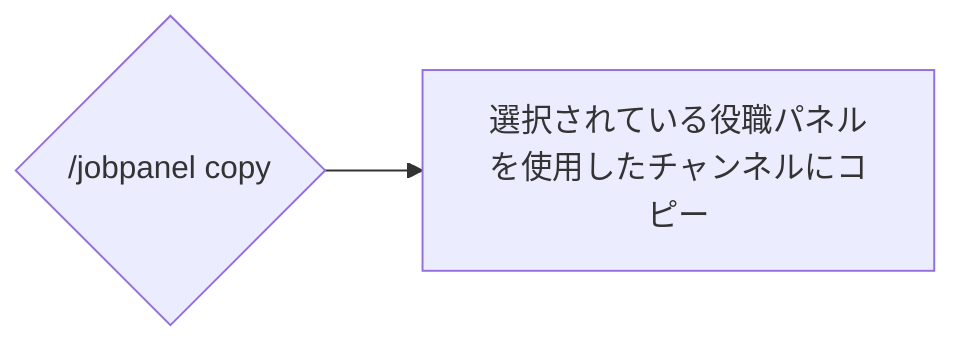
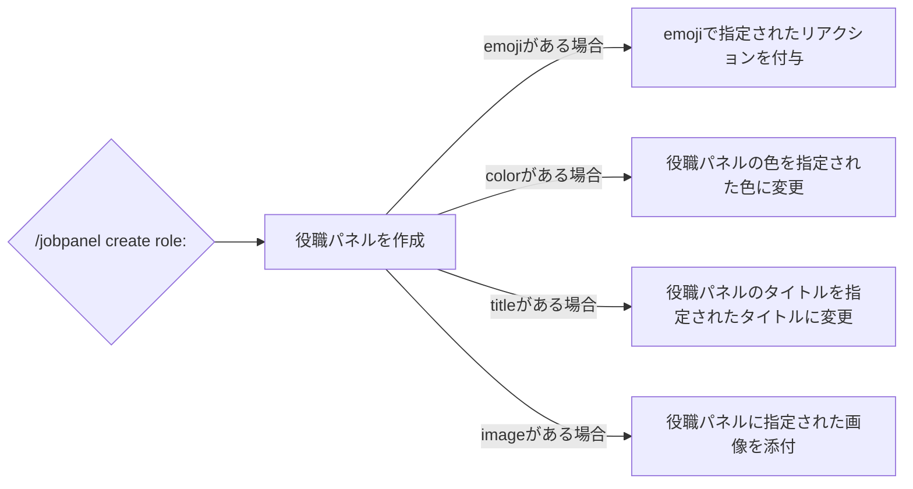
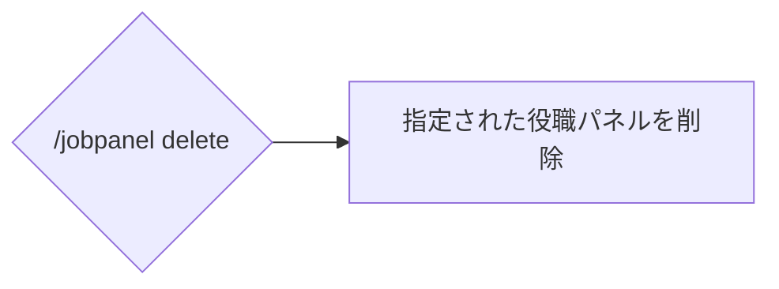
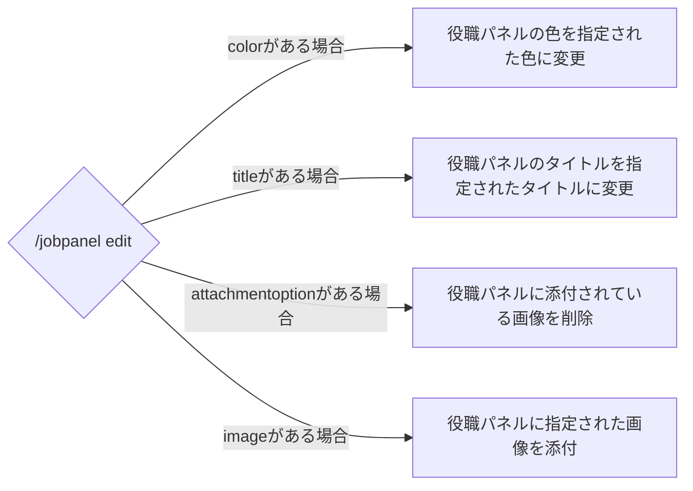
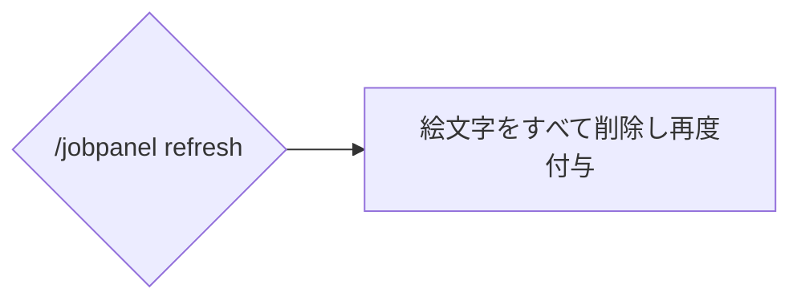
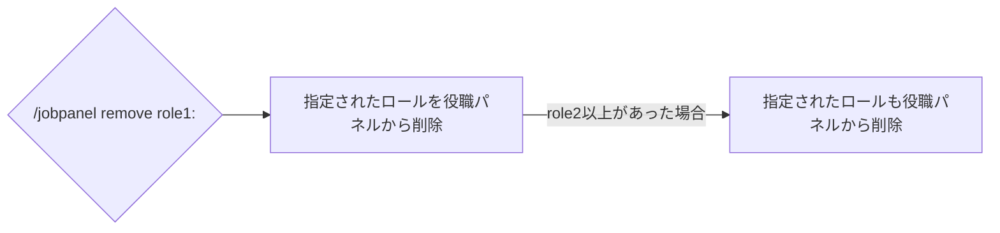
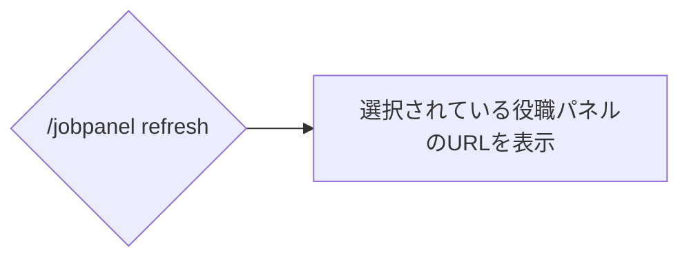

# /jobpanel
## 概要
役職を付与したり外したりするパネルに関するコマンドです。

## 使用方法
```
/jobpanel <subcommand>
```

!!!warning
このコマンドは単体では使用できません。サブコマンドの指定を行ってください。
!!!

!!!danger
サブコマンドの一部では **<u>役職パネルを選択していないと失敗します。</u>**  
[こちら](#役職パネルの選択方法)から役職パネルを選択してください。
!!!

サブコマンド名 | 概要 | ガイド
-- | -- | --
add | パネルに役職を追加します | [!badge variant="success" icon="paper-airplane" iconAlign="right" text="見る"](#add)
autoremove | 選択しているパネルに含まれる削除されたロールを取り除きます。 | [!badge variant="success" icon="paper-airplane" iconAlign="right" text="見る"](#autoremove)
copy | 選択しているパネルをコピーします。 | [!badge variant="success" icon="paper-airplane" iconAlign="right" text="見る"](#copy)
create | 役職パネルを作成します。 | [!badge variant="success" icon="paper-airplane" iconAlign="right" text="見る"](#create)
delete | 選択したパネルを削除します。 | [!badge variant="success" icon="paper-airplane" iconAlign="right" text="見る"](#delete)
edit | 選択したパネルのタイトルやカラーを変更します。 | [!badge variant="success" icon="paper-airplane" iconAlign="right" text="見る"](#edit)
refresh | 選択したパネルのリアクションをつけ直します。 | [!badge variant="success" icon="paper-airplane" iconAlign="right" text="見る"](#refresh)
remove | パネルから役職を削除します。 | [!badge variant="success" icon="paper-airplane" iconAlign="right" text="見る"](#remove)
selected | 現在選択しているパネルのリンクを返します。 | [!badge variant="success" icon="paper-airplane" iconAlign="right" text="見る"](#selected)

### add
#### 使用方法
```
/jobpanel add role1: <option>
```

オプション名 | 概要 | 必要かどうか
--- | --- | --
role1 | 付与する役職 | **<u>はい</u>**
emoji1 | role1に対応させる絵文字 | いいえ
role2 ~ role10 | role1以外で付与する役職 | いいえ
emoji2 ~ emoji10 | role2 ~ role10に対応させる絵文字 | いいえ

#### 動作


### autoremove
#### 使用方法
```
/jobpanel autoremove
```

#### 動作


### copy
#### 使用方法
```
/jobpanel copy
```

#### 動作


### create
#### 使用方法
```
/jobpanel create role: <option>
```

オプション名 | 概要 | 必要かどうか
--- | --- | --
role | 付与する役職 | **<u>はい</u>**
emoji | roleに対応させる絵文字 | いいえ
color | 役職パネルの色 | いいえ
title | 役職パネルのタイトル | いいえ
image | 役職パネルに添付する画像 | いいえ

#### 動作


### delete
#### 使用方法
```
/jobpanel delete
```

#### 動作


### edit
#### 使用方法
```
/jobpanel edit <option>

```
!!!info
このコマンドはオプションを指定しなくても使用可能ですが、指定していない場合効果がありません。
!!!

オプション名 | 概要 | 必要かどうか
--- | --- | --
color | 役職パネルの色 | いいえ
title | 役職パネルのタイトル | いいえ
attachmentoption | 役職パネルの添付画像を削除するかどうか | いいえ
image | 役職パネルに添付する画像 | いいえ

#### 動作


### refresh
#### 使用方法
```
/jobpanel refresh 
```

#### 動作


### remove
#### 使用方法
```
/jobpanel remove role1: <option> 
```

オプション名 | 概要 | 必要かどうか
-- | -- | --
role1 | 削除するロール | **<u>はい</u>**
role2 ~ role25 | role1以外に削除するロール | いいえ

#### 動作


### selected
#### 使用方法
```
/jobpanel selected
```

#### 動作


## 役職パネルの選択方法
#### 役職パネルを右クリック

#### アプリの「パネルを選択」をクリック

#### 以下のようなメッセージが表示されればOK


!!!warning
画像未準備
!!!